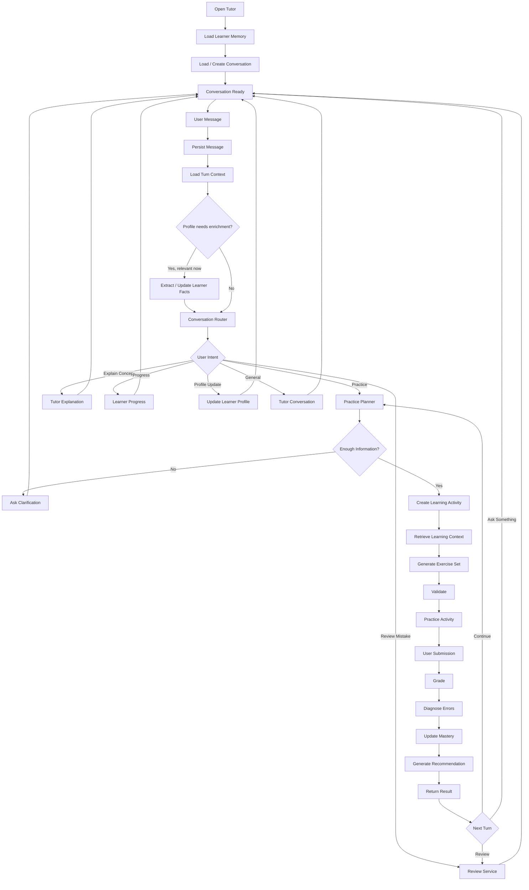

# Chat Flow Redesign Notes — Adaptive AI English Tutor

## 1. Mục tiêu refactor

Flow hiện tại của project không sai về business logic, nhưng đang bị **fix cứng theo implementation hiện tại**.

Sau onboarding, conversation gần như bị ép về:

```text
User message
    ↓
Practice request
    ↓
Generate exercise
```

Điều này khiến chatbot chưa thực sự hoạt động như một **AI Tutor conversation system**.

Mục tiêu của refactor là chuyển từ:

```text
Chat UI để tạo bài tập
```

sang:

```text
Conversation platform chứa nhiều loại learning activities
```

Hệ thống sau refactor cần hỗ trợ tự nhiên các tình huống:

```text
"Cho tôi 10 câu passive voice."
"Tại sao câu 3 của tôi sai?"
"Past Perfect dùng khi nào?"
"Tôi đang yếu phần nào?"
"Bài vừa rồi khó quá."
"Từ giờ cho tôi bài khó hơn."
"Cho tôi luyện tiếp phần tôi yếu nhất."
```

---

# 2. Vấn đề chính của flow hiện tại

Mental model hiện tại gần giống:

```text
User Message
     ↓
Có đang onboarding?
     │
     ├── Có
     │    ↓
     │  Interpret onboarding
     │
     └── Không
          ↓
       Interpret practice request
          ↓
       Generate exercise
```

Sau onboarding, gần như mọi message đều bị xem như một `PracticeRequest`.

Đây là điểm coupling lớn nhất.

Các message như:

```text
"Tại sao câu vừa rồi sai?"
```

hoặc:

```text
"Tôi yếu kỹ năng nào nhất?"
```

không nên đi qua `PracticeIntentInterpreter`.

---

# 3. Nguyên tắc redesign

## 3.1 Không bắt đầu từ UI screen

Không nên dùng main conversational flow để mô tả:

```text
Screen: generating
Screen: practice
Screen: result

POST /api/practice/generate
POST /api/practice/score
```

Đây là implementation detail.

Main flow nên trả lời:

> User đang muốn làm gì ở turn này?

Backend flow mới trả lời:

> Hệ thống thực hiện intent đó như thế nào?

Frontend flow mới trả lời:

> UI cần render trạng thái nào?

---

# 4. Thay đổi mental model

Không nên hỏi:

```text
User đang ở mode nào?
```

Ví dụ:

```text
Onboarding Mode
Practice Mode
Result Mode
```

Nên hỏi:

```text
User đang muốn làm gì ở turn hiện tại?
```

Ví dụ user đang ở result screen nhưng hỏi:

```text
"Tại sao câu 2 sai?"
```

Hệ thống nên xử lý:

```text
User Message
     ↓
Intent Router
     ↓
REVIEW
     ↓
Load latest practice context
     ↓
Explain mistake
```

Không cần ép user quay lại một screen hoặc mode cụ thể.

---

# 5. Conversation Router

Nên thêm một layer phía trước các interpreter/service hiện tại:

```text
User Message
     ↓
Conversation Router
     ↓
Intent-specific Service
```

Các intent ban đầu chỉ cần khoảng 6 loại.

| Intent | Ví dụ |
|---|---|
| `PRACTICE` | "Cho tôi 10 câu passive voice" |
| `EXPLAIN` | "Past Perfect khác Past Simple thế nào?" |
| `REVIEW` | "Tại sao câu 3 sai?" |
| `PROGRESS` | "Tôi đang yếu phần nào?" |
| `PROFILE_UPDATE` | "Từ giờ cho tôi bài khó hơn" |
| `GENERAL` | Conversation / fallback |

Không cần tạo quá nhiều intent ngay từ đầu.

---

# 6. Onboarding không nhất thiết là một intent

Onboarding nên được xem như **profile enrichment condition**.

Thay vì:

```text
Step 1
 ↓
Step 2
 ↓
Step 3
 ↓
Step 4
 ↓
Step 5
 ↓
Step 6
```

nên dùng:

```text
User Message
      ↓
Extract Profile Facts
      ↓
Merge Profile Draft
      ↓
Missing Important Fields?
      │
      ├── Yes → Ask Best Next Question
      │
      └── No → Continue
```

Ví dụ user nói ngay:

```text
"Mình là Phúc, B1, đang học IELTS,
yếu phần thì, muốn bài medium khoảng 10 câu."
```

Hệ thống có thể lấy nhiều profile fields trong một turn.

---

# 7. Progressive Profiling

Không nên bắt user hoàn thành toàn bộ onboarding trước khi dùng hệ thống.

Nên chia profile thành:

```text
Minimum Viable Profile
```

và:

```text
Progressive Profile
```

Ví dụ user nói:

```text
"Cho tôi 5 câu Present Simple."
```

Đã đủ để tạo một activity.

Không cần bắt user khai báo trước:

```text
Tên
Level
Goal
Weak topic
Difficulty
Question count
```

Có thể thu thập dần.

Ví dụ:

```text
Unknown level
      ↓
Generate calibration activity
      ↓
Observe performance
      ↓
Estimate level
```

---

# 8. Tách Conversation State và Learning Activity State

Đây là thay đổi quan trọng nhất.

## Conversation State

```text
conversation_id
messages
memory_summary
active_intent
pending_clarification
recent_context
```

Conversation tồn tại xuyên suốt quá trình chat.

## Learning Activity State

```text
activity_id
activity_type
status
exercise_set
answers
score
diagnoses
recommendation
```

Practice chỉ là một dạng learning activity.

Hai state này liên quan nhưng không được trộn làm một.

---

# 9. Conversation chứa Learning Activities

Mental model nên là:

```text
Conversation
│
├── Message
├── Message
├── Practice Activity
│      ├── exercises
│      ├── submission
│      └── result
│
├── Message
├── Explanation
└── Recommendation
```

Ví dụ:

```text
User:
Cho tôi 5 câu Past Simple.

Tutor:
Được, bắt đầu nhé.

[Practice Activity #123]

User completes activity.

Tutor:
Bạn đúng 3/5.

User:
Tại sao câu 2 sai?

Tutor:
Vì "yesterday" yêu cầu Past Simple...
```

Conversation không kết thúc khi practice kết thúc.

---

# 10. Ba domain model chính

Trước khi sửa code, nên chốt ba model:

```text
Learner
Conversation
LearningActivity
```

Quan hệ:

```text
Learner
  │
  ├── Profile
  ├── Mastery
  ├── Preferences
  │
  └── Conversations
         │
         ├── Conversation 1
         │      ├── Messages
         │      └── Learning Activities
         │
         └── Conversation 2
                ├── Messages
                └── Learning Activities
```

---

# 11. Learner State

Learner state là long-term state.

```text
Learner
│
├── Profile
├── Goals
├── Preferences
├── Mastery
├── Weak Skills
├── Learning History
└── Recommendation History
```

New Chat không được reset learner state.

---

# 12. Conversation State

Conversation là medium-term state.

```text
Conversation
│
├── Messages
├── Summary
├── Current Topic
├── Pending Clarification
├── Active Activity
└── Recent Context
```

Khi user tạo `New Chat`:

```text
New Conversation
      ↓
new messages
new short-term context
```

nhưng vẫn giữ:

```text
Learner Profile
Mastery
Preferences
Weak Skills
```

---

# 13. Learning Activity

Practice nên trở thành một `LearningActivity`.

Có thể mở rộng về sau:

```text
LearningActivity
│
├── Practice
├── Review
├── Calibration
├── Quiz
├── Reading
└── Conversation Exercise
```

Ví dụ model:

```python
LearningActivity:
    id
    conversation_id
    learner_id
    type
    status

    target_skills
    difficulty

    created_at
    started_at
    completed_at
```

---

# 14. Practice Activity Lifecycle

Nên có lifecycle riêng:

```text
CREATED
   ↓
GENERATING
   ↓
READY
   ↓
IN_PROGRESS
   ↓
SUBMITTED
   ↓
GRADED
   ↓
COMPLETED
```

Có thể thêm:

```text
FAILED
CANCELLED
```

Không dùng UI screen làm business state.

---

# 15. Intent Router Architecture

```text
                     User Message
                          │
                          ▼
                  Conversation Service
                          │
             ┌────────────┴────────────┐
             │                         │
             ▼                         ▼
        Load Context               Persist Message
             │
             ▼
        Intent Router
             │
 ┌───────────┼───────────┬───────────┬────────────┐
 │           │           │           │            │
 ▼           ▼           ▼           ▼            ▼
Practice   Explain     Review      Progress     Profile
 │           │           │           │            │
 ▼           ▼           ▼           ▼            ▼
Practice   Tutor       Review      Learner     Profile
Service    Service     Service     Service      Service
```

---

# 16. Practice Intent Interpreter vẫn giữ lại

Không cần xóa code `PracticeIntentInterpreter`.

Thay vì gọi trực tiếp:

```text
Message
   ↓
PracticeIntentInterpreter
```

đổi thành:

```text
Message
   ↓
ConversationRouter
   ↓
PRACTICE
   ↓
PracticeIntentInterpreter
```

Như vậy toàn bộ logic hiện tại về:

```text
topic
target_subtopic
difficulty
exercise_type
num_questions
content_theme
```

vẫn tái sử dụng được.

---

# 17. Pending Clarification

Conversation state nên hỗ trợ:

```text
pending_intent
missing_fields
collected_slots
```

Ví dụ:

```text
User:
Tôi muốn luyện thì quá khứ.
```

Router:

```text
intent = PRACTICE
topic = past tense
num_questions = missing
```

Bot:

```text
Bạn muốn bao nhiêu câu?
```

State:

```text
pending_intent = PRACTICE
missing_field = num_questions
```

User:

```text
5 câu thôi.
```

System merge:

```text
topic = past tense
num_questions = 5
```

sau đó generate.

Đây là conversational slot filling.

---

# 18. Flow conversation đề xuất



---

# 19. Tách thành ba diagram riêng

Không nên tiếp tục cố nhét mọi thứ vào một Mermaid lớn.

## Diagram 1 — Conversation / Product Flow

Mô tả:

```text
User intention
Conversation
Learning activities
```

Không chứa endpoint.

## Diagram 2 — Backend System Flow

```text
Frontend
   ↓
Conversation API
   ↓
Conversation Orchestrator
   ↓
Intent Router
   ↓
Domain Service
   ↓
Repositories / RAG / LLM
```

## Diagram 3 — Practice Lifecycle

```text
CREATED
   ↓
GENERATING
   ↓
READY
   ↓
IN_PROGRESS
   ↓
SUBMITTED
   ↓
GRADED
   ↓
COMPLETED
```

---

# 20. UI State vẫn có thể giữ riêng

Frontend có thể vẫn dùng:

```text
chat
loading
practice
result
review
error
```

nhưng đây chỉ là UI state.

Không được đồng nhất chúng với business state.

Ví dụ:

```text
UI state = result
```

không có nghĩa conversation đã kết thúc.

---

# 21. Review nên là capability riêng

Không nên:

```text
Result
  ↓
View Answers
  ↓
Back to Practice Screen
```

Nên hỗ trợ:

```text
REVIEW intent
```

với context:

```text
question
user_answer
correct_answer
error_type
skill
explanation
mastery_impact
```

---

# 22. Recommendation không cần quay lại generic request flow

Hiện kiểu:

```text
Result
   ↓
Use Recommendation
   ↓
Practice Request
   ↓
Parse Again
```

không cần thiết.

Nếu recommendation đã chứa:

```text
skill
difficulty
exercise_type
num_questions
```

thì:

```text
Recommendation
      ↓
Accept
      ↓
Practice Planner
      ↓
Generate Activity
```

Có thể bỏ qua intent parsing.

---

# 23. Backend fallback

Fallback không nên nằm frontend.

Sai:

```text
Backend generation failed
       ↓
Frontend fallback exercise
```

Nên:

```text
Generate
   ↓
Validate
   ↓
Failure
   ↓
Backend Retry
   ↓
Template / Rule-based Fallback
   ↓
Return canonical ExerciseSet
```

Frontend chỉ nhận một `ExerciseSet`.

---

# 24. Scoring cũng nên ở backend

Không nên dùng:

```text
generationRunId exists?
       │
       ├── Yes → backend score
       └── No → local score
```

Mỗi activity phải có canonical ID:

```text
activity_id
practice_id
exercise_set_id
```

Backend luôn xử lý grading.

---

# 25. Không nên dùng generationRunId làm business identity

`generationRunId` phù hợp cho:

```text
Tracing
Debugging
Observability
```

Không nên dùng làm identity chính của practice.

Nên có:

```text
practice_id
```

hoặc:

```text
learning_activity_id
```

Ví dụ:

```json
{
  "activity_id": "activity_123",
  "practice_id": "practice_456",
  "generation_run_id": "gen_789"
}
```

---

# 26. API direction đề xuất

## Conversation

```text
POST   /api/conversations
GET    /api/conversations
GET    /api/conversations/{id}
POST   /api/conversations/{id}/messages
```

## Activities

```text
POST   /api/activities
GET    /api/activities/{id}
POST   /api/activities/{id}/submit
```

Hoặc practice-specific:

```text
POST   /api/practices
GET    /api/practices/{id}
POST   /api/practices/{id}/submit
GET    /api/practices/{id}/review
```

## Learner

```text
GET    /api/learner/profile
PATCH  /api/learner/profile

GET    /api/learner/mastery
GET    /api/learner/progress
```

## Recommendation

```text
GET    /api/recommendations
POST   /api/recommendations/{id}/accept
```

---

# 27. Architecture mục tiêu

```text
                   User Message
                        │
                        ▼
               Conversation API
                        │
                        ▼
             Conversation Orchestrator
                        │
                        ▼
                   Intent Router
                        │
       ┌────────────────┼────────────────┐
       │                │                │
       ▼                ▼                ▼
    Practice         Explain          Review
       │                │                │
       ▼                ▼                ▼
Practice Service    Tutor Service    Review Service
       │
       ▼
Learning Planner
       │
 ┌─────┼─────────┐
 ▼     ▼         ▼
RAG  Learner   Skill Graph
      State
       │
       ▼
Exercise Generator
       │
       ▼
Validator
       │
       ▼
Learning Activity
       │
       ▼
Grader
       │
       ▼
Error Diagnosis
       │
       ▼
Mastery Update
       │
       ▼
Recommendation
```

---

# 28. Phần code hiện tại có thể giữ lại

Không cần rewrite toàn bộ.

Có thể giữ:

```text
OnboardingInterpreter
PracticeIntentInterpreter
Chat History / Session
Memory Summary
RAG
Exercise Generator
Validator
Scorer
Error Diagnosis
Recommendation
```

Phần cần refactor chính:

```text
Conversation orchestration
Intent routing
State boundaries
Practice identity
Activity lifecycle
```

---

# 29. Thứ tự refactor đề xuất

## Phase 1 — Domain boundaries

Chốt:

```text
Learner
Conversation
LearningActivity
```

## Phase 2 — Conversation Router

Thêm:

```text
ConversationRouter
```

với các intent:

```text
PRACTICE
EXPLAIN
REVIEW
PROGRESS
PROFILE_UPDATE
GENERAL
```

## Phase 3 — Refactor Practice Flow

Tạo:

```text
Practice / LearningActivity
```

với ID và lifecycle rõ ràng.

Loại bỏ phụ thuộc business logic vào `generationRunId`.

## Phase 4 — Backend-only fallback

Di chuyển:

```text
exercise fallback
grading
validation retry
```

về backend.

## Phase 5 — Progressive Profiling

Không bắt onboarding strict.

Cho phép:

```text
profile enrichment per turn
```

## Phase 6 — Review / Progress capabilities

Thêm:

```text
ReviewService
ProgressService
TutorExplainService
```

## Phase 7 — Recommendation continuation

Cho recommendation tạo activity trực tiếp.

Không parse lại thành generic practice request.

---

# 30. Checklist refactor

## Conversation

- [ ] Add `ConversationRouter`
- [ ] Add explicit intent enum
- [ ] Add pending clarification state
- [ ] Preserve recent conversational context
- [ ] Separate conversation from practice state

## Learner

- [ ] Keep learner state across New Chat
- [ ] Separate learner profile from chat session
- [ ] Support progressive profile updates
- [ ] Add mastery state later

## Learning Activity

- [ ] Introduce `activity_id`
- [ ] Introduce explicit activity status
- [ ] Persist activity lifecycle
- [ ] Link activity to conversation
- [ ] Link activity to learner

## Practice

- [ ] Remove frontend exercise fallback
- [ ] Remove local score fallback
- [ ] Backend owns grading
- [ ] Backend owns validation/retry
- [ ] Do not use `generationRunId` as practice identity

## Routing

- [ ] `PRACTICE`
- [ ] `EXPLAIN`
- [ ] `REVIEW`
- [ ] `PROGRESS`
- [ ] `PROFILE_UPDATE`
- [ ] `GENERAL`

## Onboarding

- [ ] Replace strict wizard with progressive profiling
- [ ] Allow multiple profile facts from one user message
- [ ] Do not block practice if enough request information exists
- [ ] Ask only relevant missing fields

## Review

- [ ] Add review capability
- [ ] Load previous activity context
- [ ] Explain individual mistakes
- [ ] Show skill/error metadata

## Recommendation

- [ ] Recommendation should contain structured next activity
- [ ] Accept recommendation directly
- [ ] Do not re-parse accepted recommendation

---

# 31. Key design decision

Refactor từ:

```text
Chat UI
   ↓
Practice Generator
```

sang:

```text
Conversation Platform
        ↓
Intent Router
        ↓
Learning Capabilities
        ↓
Learning Activities
```

---

# 32. Target mental model

Cuối cùng, hệ thống nên được hiểu như:

```text
Learner
   │
   ├── Long-term Learner State
   │
   └── Conversations
            │
            ├── Messages
            │
            └── Learning Activities
                    │
                    ├── Practice
                    ├── Review
                    ├── Explanation
                    └── Future Activity Types
```

Không còn:

```text
User đang ở Practice Mode hay Result Mode?
```

mà là:

```text
User đang muốn làm gì ở turn này?
```

và:

```text
Conversation hiện có activity/context nào liên quan?
```

Đây nên là nền tảng để sau này thêm:

```text
Learner Mastery
Skill Graph
Adaptive Recommendation
LangGraph
RAG
Memory
Evaluation
```

mà không phải redesign conversation flow thêm lần nữa.
