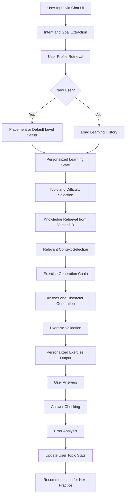
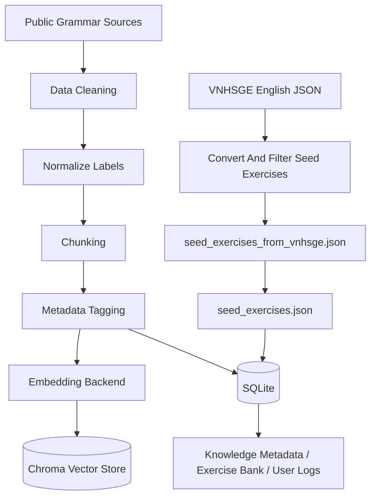

# Proposal Đồ án NLP

## Tên đề tài

### Tiếng Việt
**Xây dựng chatbot sinh bài tập tiếng Anh cá nhân hóa sử dụng truy xuất ngữ nghĩa và mô hình Transformer**

### Tiếng Anh
**Personalized English Exercise Generation using Semantic Retrieval and Transformer-based Models**

---

## 1. Tổng quan đề tài

Đề tài hướng đến việc xây dựng một hệ thống chatbot hỗ trợ người học tiếng Anh luyện tập theo hướng cá nhân hóa. Thay vì sinh bài tập ngẫu nhiên, hệ thống sẽ dựa trên mục tiêu học tập, trình độ, lịch sử làm bài và điểm yếu của từng người học để tạo ra các bài tập phù hợp.

Hệ thống áp dụng các kỹ thuật xử lý ngôn ngữ tự nhiên và Retrieval-Augmented Generation, kết hợp giữa:

- phân tích yêu cầu người dùng bằng ngôn ngữ tự nhiên
- truy xuất ngữ nghĩa từ knowledge base
- sinh bài tập bằng mô hình ngôn ngữ
- chấm bài và phân tích lỗi sai
- cập nhật hồ sơ học tập để đề xuất bài luyện tiếp theo

Phiên bản hiện tại của dự án được định hướng triển khai bằng:

- `Next.js` cho giao diện người dùng
- `FastAPI` cho backend API
- `LangChain` cho orchestration của retrieval và generation
- `SQLite` cho dữ liệu có cấu trúc
- `Chroma` cho vector store
- `Ollama` cho LLM local trong môi trường Docker

---

### 1.1. Cập nhật trạng thái triển khai hiện tại

Tính đến bản cập nhật hiện tại, dự án đã vượt qua mức prototype ban đầu và có thể chạy như một MVP end-to-end:

- Frontend `Next.js` có giao diện chatbot, màn hình làm bài, kết quả, typing indicator, scroll trong khung chat và trang xem cá nhân hóa.
- Backend `FastAPI` có API generate bài, chấm bài, onboarding, lưu chat memory, resume chat và snapshot cá nhân hóa.
- LLM local được tích hợp bằng `Ollama`, hiện dùng model `llama3.1:8b` trong Docker.
- Pipeline có hybrid intent extraction: rule-based + LLM interpreter cho tiếng Việt/tiếng Anh.
- Có SQLite persistence cho user profile, generation runs, practice sessions, answers, practice reviews, chat sessions và chat memory summaries.
- Có deep personalization ở mức topic, subtopic và error tag.
- Có knowledge base và seed exercise bank trong `data/processed`.
- Có script chuyển đổi VNHSGE English dataset thành seed exercises có lọc, giúp mở rộng seed bank từ 100 lên 190 câu.
- Có fallback seed/frontend để demo vẫn tiếp tục khi LLM timeout hoặc backend chưa phản hồi ổn.
- Có trang `/personalization` dùng Ant Design để hiển thị profile, weak topics, weak subtopics, frequent errors và next plan.

Một số giới hạn còn lại được ghi nhận để phát triển sau MVP:

- Người dùng hiện vẫn chủ yếu dùng `demo-user`, chưa có login/user selector thật.
- `content_theme` như anime đã được nhận diện nhưng chưa enforce mạnh trong mọi trường hợp fallback.
- Evaluation tự động và test suite vẫn cần bổ sung thêm.
- Docker đang dùng vector store in-memory cho demo; Chroma là hướng lưu vector store ổn định hơn về sau.

---

## 2. Bài toán cần giải quyết

Người học tiếng Anh thường gặp các vấn đề sau:

- Không biết mình yếu phần nào.
- Bài tập luyện thường không phù hợp trình độ.
- Thiếu phản hồi chi tiết sau khi làm sai.
- Không có lộ trình luyện tập tiếp theo.
- Nhiều nền tảng chỉ dùng ngân hàng bài tập cố định, ít cá nhân hóa.

Từ đó, đề tài đặt ra bài toán:

> Làm thế nào để xây dựng một chatbot có thể tự động sinh bài tập tiếng Anh phù hợp với trình độ, mục tiêu và điểm yếu của từng người học, đồng thời có khả năng giải thích, chấm bài và đề xuất vòng luyện tập tiếp theo?

---

## 3. Mục tiêu đề tài

Hệ thống cần đạt các mục tiêu chính:

1. Cho phép người dùng nhập yêu cầu luyện tập bằng ngôn ngữ tự nhiên.
2. Phân tích topic, số lượng câu hỏi, loại bài và độ khó mong muốn.
3. Truy xuất kiến thức tiếng Anh liên quan từ vector database.
4. Sinh bài tập tiếng Anh cá nhân hóa theo topic và learner profile.
5. Tạo đáp án, distractor và giải thích.
6. Chấm bài sau khi người dùng trả lời.
7. Phân tích lỗi sai và cập nhật hồ sơ học tập.
8. Đề xuất bài luyện tiếp theo dựa trên weakness profile.

---

## 4. Phạm vi đề tài

### 4.1. Phạm vi MVP

Phiên bản MVP tập trung vào:

- Grammar MCQ
- Vocabulary MCQ
- Fill-in-the-blank
- Cá nhân hóa theo learner profile
- Phân tích lỗi sai ở mức topic / subtopic
- Đề xuất bài luyện tiếp theo
- Chat onboarding để thu thập thông tin ban đầu theo kiểu hội thoại
- Lưu lịch sử chat và rút trích một số thông tin học tập từ hội thoại
- Sinh/chấm bài bằng backend thật, có lưu generated exercise snapshot
- Trang xem trạng thái cá nhân hóa của người học

### 4.2. Các phần chưa triển khai trong MVP

Các phần sau được xem là future work:

- Login hoặc user selector thay cho `demo-user`
- Evaluation tự động đầy đủ cho retrieval, generation và personalization
- Enforce mạnh `content_theme` trong mọi trường hợp sinh đề/fallback
- Tách model LLM theo tác vụ, ví dụ model nhỏ cho chat/intent và model lớn hơn cho generation
- Speaking practice
- Pronunciation assessment
- Essay writing correction
- Voice-based chatbot
- Adaptive learning nâng cao
- Fine-tune mô hình theo dữ liệu nội bộ

---

## 5. Đối tượng sử dụng

Hệ thống hướng đến nhiều nhóm người học tiếng Anh, bao gồm:

- Người mới học tiếng Anh
- Học sinh, sinh viên
- Người đi làm muốn ôn lại ngữ pháp
- Người học cần luyện tập theo điểm yếu cá nhân
- Người chuẩn bị cho các kỳ thi tiếng Anh cơ bản

---

## 6. Workflow hệ thống



---

## 7. Giải thích workflow

### 7.1. User Input via Chat UI

Người học nhập yêu cầu vào giao diện chatbot.

Ví dụ:

```text
Tôi yếu passive voice, tạo cho tôi 10 câu mức dễ.
```

Hoặc:

```text
Tạo bài luyện vocabulary chủ đề business mức intermediate.
```

### 7.2. Intent and Goal Extraction

Hệ thống phân tích yêu cầu để trích xuất:

- topic
- target subtopic nếu người dùng nói rõ như quá khứ đơn, bị động với modal
- difficulty
- số lượng câu hỏi
- loại bài
- mục tiêu học tập
- content theme hoặc sở thích ngữ cảnh, ví dụ anime

Ví dụ:

```json
{
  "intent": "generate_exercise",
  "topic": "tenses",
  "target_subtopic": "past_simple_finished_time",
  "num_questions": 10,
  "difficulty": "easy",
  "exercise_type": "grammar_mcq",
  "content_theme": "anime",
  "goal": "grammar_practice"
}
```

Hướng triển khai MVP:

- rule-based keyword mapping và regex cho các tín hiệu rõ ràng
- bilingual normalization để xử lý cả tiếng Việt và tiếng Anh
- Ollama-based intent interpreter để đọc đoạn chat, hiểu ngữ cảnh gần đây và trích xuất intent linh hoạt hơn
- dùng memory từ các đoạn chat trước để bổ sung sở thích ổn định như số câu, độ khó, mục tiêu hoặc content theme

### 7.3. User Profile Retrieval

Hệ thống lấy hồ sơ học tập của người dùng, gồm:

- trình độ hiện tại
- preferred difficulty
- topic accuracy
- weak topics
- lịch sử làm bài

Ví dụ:

```json
{
  "user_id": "demo-user",
  "level": "intermediate",
  "preferred_difficulty": "medium",
  "weak_topics": {
    "passive_voice": 0.55,
    "relative_clause": 0.38
  },
  "topic_accuracy": {
    "passive_voice": 0.45,
    "tenses": 0.78
  }
}
```

### 7.4. Placement or Default Level Setup

Nếu là người dùng mới, hệ thống có thể:

- dùng một bài test ngắn để gán level ban đầu
- hoặc dùng default level trong MVP nếu chưa có placement test đầy đủ
- hỏi onboarding theo dạng hội thoại để thu thập tên gọi, trình độ ước lượng, mục tiêu, điểm yếu, độ khó và số câu mong muốn
- nếu người dùng không rõ trình độ, hệ thống giữ nhịp dễ trước rồi điều chỉnh dựa trên kết quả làm bài

### 7.5. Topic and Difficulty Selection

Dựa trên yêu cầu người dùng và learner profile, hệ thống chọn:

- topic phù hợp
- difficulty phù hợp
- exercise type phù hợp

Ví dụ:

- nếu topic accuracy của `passive_voice` nhỏ hơn 0.6 thì ưu tiên mức `easy`
- nếu accuracy lớn hơn hoặc bằng 0.8 thì có thể tăng lên `medium` hoặc đổi subtopic

### 7.6. Knowledge Retrieval from Vector DB

Hệ thống truy xuất context liên quan từ vector database.

Ví dụ query:

```text
passive voice beginner grammar exercises
```

Vector DB trả về các grammar chunks như:

```text
The present simple passive is formed with am/is/are + past participle.
```

### 7.7. Relevant Context Selection

Từ các kết quả retrieval, hệ thống chọn các context phù hợp nhất để đưa vào generation chain.

### 7.8. Exercise Generation Chain

Prompt chain kết hợp:

- request của người dùng
- learner profile
- retrieved context
- output schema

Ví dụ:

```text
Context:
The present simple passive is formed with am/is/are + past participle.

Task:
Generate 5 beginner-level multiple-choice grammar questions about passive voice.
Each question must have 4 options, one correct answer, and explanation.
```

### 7.9. Answer and Distractor Generation

Hệ thống sinh:

- đáp án đúng
- distractor hợp lý
- explanation

Ví dụ:

```text
Question: The room ____ every day.

A. cleans
B. is cleaned
C. cleaned
D. cleaning

Correct answer: B
```

### 7.10. Exercise Validation

Trước khi trả bài cho người dùng, hệ thống kiểm tra:

- có đủ số câu hỏi
- MCQ có đủ 4 options
- chỉ có 1 đáp án đúng
- output đúng topic
- distractor không quá vô lý
- explanation không rỗng
- bài sinh ra không quá trùng lặp

### 7.11. User Answers

Người dùng làm bài trực tiếp trong giao diện web chatbot.

Trong định hướng hiện tại của dự án:

- giao diện dùng `Next.js`
- frontend gọi backend `FastAPI` qua HTTP API

### 7.12. Answer Checking

Hệ thống chấm đáp án bằng cách so sánh câu trả lời của người học với `correct_answer` đã lưu trong session exercise snapshot.

Ví dụ:

```python
if user_answer == correct_answer:
    result = "correct"
else:
    result = "incorrect"
```

### 7.13. Error Analysis

Hệ thống phân tích người dùng sai ở topic nào, subtopic nào, và loại lỗi nào.

Ví dụ:

```json
{
  "topic": "passive_voice",
  "subtopic": "past_simple_passive",
  "accuracy": 0.4,
  "weakness_score": 0.6,
  "status": "weak"
}
```

### 7.14. Update User Topic Stats

Sau mỗi phiên luyện tập, hệ thống cập nhật:

- attempts count
- correct count
- accuracy
- weakness score
- last practiced time

### 7.15. Recommendation for Next Practice

Hệ thống đề xuất bài luyện tiếp theo.

Ví dụ:

```text
Bạn đang sai nhiều ở Passive Voice - Past Simple.
Mình đề xuất bạn luyện thêm 10 câu mức easy-medium về chủ đề này.
```

---

## 8. Kiến trúc hệ thống

Hệ thống được chia thành 5 layer chính:

### 8.1. Interaction Layer

Chức năng:

- Chat UI
- Nhận yêu cầu người dùng
- Hiển thị bài tập
- Hiển thị kết quả và gợi ý

Công nghệ đề xuất:

- `Next.js App Router`
- React
- fetch API đến FastAPI backend

### 8.2. API and Orchestration Layer

Chức năng:

- nhận request từ frontend
- điều phối pipeline generate / score
- quản lý request schema và response schema

Công nghệ đề xuất:

- `FastAPI`
- Pydantic
- Python service orchestration

### 8.3. Retrieval Layer

Chức năng:

- lưu knowledge chunks
- chunking
- embedding
- semantic retrieval

Công nghệ đề xuất:

- `LangChain`
- `Chroma`
- `RecursiveCharacterTextSplitter`
- embedding backend có thể thay thế: `sentence-transformers` hoặc `Ollama embeddings`

### 8.4. Generation Layer

Chức năng:

- sinh câu hỏi
- sinh đáp án
- sinh distractors
- sinh explanation
- validate bài tập

Công nghệ đề xuất:

- `LangChain` prompt chain
- backend LLM linh hoạt: `OpenAI` hoặc `Ollama/local model`
- Pydantic output parser
- Python validation rules

### 8.5. Personalization Layer

Chức năng:

- lưu user profile
- theo dõi history
- lưu session snapshots
- phân tích lỗi sai
- cập nhật topic stats
- đề xuất bài luyện tiếp theo

Công nghệ đề xuất:

- `SQLite`
- Python statistics
- rule-based recommendation

---

## 9. Tech Stack

| Module | Công nghệ sử dụng / đề xuất |
|---|---|
| Chatbot UI | Next.js App Router |
| UI Components | Ant Design cho trang personalization, CSS custom cho chatbot |
| Backend API | Python / FastAPI |
| Orchestration | LangChain |
| Intent Extraction | Hybrid rule-based + regex + Ollama intent interpreter |
| Chat Memory | SQLite chat sessions, chat messages, memory summaries |
| User Profile Storage | SQLite |
| Knowledge Base Format | Markdown / JSON / SQLite |
| Chunking | LangChain RecursiveCharacterTextSplitter |
| Embedding Backend | sentence-transformers hoặc Ollama embeddings |
| Vector Database | In-memory vector store cho demo, Chroma cho hướng mở rộng |
| Semantic Retrieval | LangChain retriever |
| Generation | LangChain prompt chain + LLM backend |
| LLM Backend | Ollama/local model, hiện dùng `llama3.1:8b`; OpenAI vẫn có thể cấu hình |
| Validation | Pydantic + Python rules |
| Answer Checking | Python logic |
| Error Analysis | Python + SQLite |
| Recommendation | Rule-based recommendation |
| Evaluation | Pandas + Matplotlib |
| Demo | Next.js + FastAPI + Ollama + Docker Compose |

---

## 10. Data Design

Dữ liệu của hệ thống gồm 4 nhóm chính:

```text
1. Knowledge Base
2. Exercise Bank
3. User Learning Data
4. Evaluation Data
```

Trạng thái dữ liệu MVP hiện tại:

- `data/processed/knowledge_chunks.json`: 120 knowledge chunks.
- `data/processed/seed_exercises.json`: 190 seed exercises, gồm 100 seed tự xây và 90 seed được convert có lọc từ VNHSGE English.
- `data/processed/seed_exercises_from_vnhsge.json`: file trung gian chứa các câu đã convert từ raw dataset.
- `scripts/convert_vnhsge_english_seed.py`: script đọc `data/raw/Dataset/VNHSGE-E/JSON format/eval/English`, bỏ câu pronunciation/stress/reading thiếu context, parse A/B/C/D và map metadata.
- Các topic đã có dữ liệu: `tenses`, `passive_voice`, `relative_clause`, `conditional_sentence`, `reported_speech`, `prepositions`, `vocabulary`, `travel_vocabulary`.
- Seed exercises có metadata `subtopic`, `difficulty`, `skill`, `exercise_type`, `error_tag`, options, correct answer và explanation.
- Có một số seed theo content theme `anime`, nhưng theme này chưa được enforce mạnh trong mọi fallback.

Thiết kế dữ liệu phải phục vụ đồng thời:

- retrieval trong RAG
- generation và validation
- personalization
- evaluation và trace output

---

## 11. Knowledge Base

Knowledge Base là dữ liệu kiến thức chính được đưa vào vector database.

### 11.1. Mục đích

Knowledge Base dùng để:

- cung cấp grammar rules
- cung cấp usage notes
- cung cấp example sentences
- cung cấp common mistakes
- làm context cho generation

### 11.2. Nguồn dữ liệu đề xuất

- British Council LearnEnglish
- Perfect English Grammar
- EF English Grammar Guide

### 11.3. Data MVP chốt

MVP hiện đã có knowledge chunks cho các topic:

```text
1. Tenses
2. Passive Voice
3. Relative Clauses
4. Conditionals
5. Reported Speech
6. Prepositions
7. Vocabulary
8. Travel Vocabulary
```

Quy mô hiện tại:

- khoảng 120 grammar chunks
- khoảng 190 bài tập mẫu
- có metadata theo topic, subtopic, level, skill và source

Hướng bổ sung sau MVP:

- tăng seed bank lên 200-300 câu
- bổ sung thêm seed theo theme/sở thích như anime, daily life, business
- mở rộng thêm vocabulary theo nhiều domain ngoài travel

### 11.4. Grammar chunk format

Mỗi grammar chunk nên có cấu trúc:

```json
{
  "chunk_id": "grammar_passive_001",
  "topic_code": "passive_voice",
  "subtopic": "present_simple_passive",
  "level": "beginner",
  "skill": "grammar",
  "content": "The present simple passive is formed with am/is/are + past participle.",
  "formula": "S + am/is/are + V3/ed",
  "examples": [
    "English is spoken in many countries."
  ],
  "common_mistakes": [
    "Forgetting the verb be.",
    "Using base verb instead of past participle."
  ],
  "source": "british_council",
  "language": "english"
}
```

---

## 12. Exercise Bank

Exercise Bank là dữ liệu bài tập mẫu, không phải output cuối cùng của hệ thống.

### 12.1. Mục đích

Exercise Bank dùng để:

- tham khảo format
- hỗ trợ distractor generation
- kiểm tra trùng lặp
- làm baseline evaluation

### 12.2. Nguồn dữ liệu đề xuất

- Perfect English Grammar
- All Things Grammar
- các bộ bài tập grammar public khác
- VNHSGE English dataset trong `data/raw/Dataset`, dùng sau bước lọc/convert để bổ sung seed exercises

### 12.3. Exercise format

```json
{
  "exercise_code": "seed_passive_001",
  "exercise_type": "grammar_mcq",
  "topic_code": "passive_voice",
  "subtopic": "present_simple_passive",
  "level": "beginner",
  "difficulty": "easy",
  "skill": "grammar",
  "error_tag": "missing_be",
  "question_text": "The room ____ every day.",
  "options": [
    { "label": "A", "text": "cleans", "is_correct": false },
    { "label": "B", "text": "is cleaned", "is_correct": true },
    { "label": "C", "text": "cleaned", "is_correct": false },
    { "label": "D", "text": "cleaning", "is_correct": false }
  ],
  "correct_answer": "B",
  "explanation": "Present simple passive uses am/is/are + V3.",
  "source": "teacher_authored_seed"
}
```

### 12.4. Generated exercise snapshots

Ngoài Exercise Bank, hệ thống còn cần lưu generated exercise snapshots theo từng session để:

- trace prompt và retrieval context
- chấm bài đúng theo bài user đã nhìn thấy
- phục vụ evaluation và fine-tune về sau

---

## 13. Error Analysis và User Learning Data

### 13.1. Error Analysis Data

Error Analysis Data dùng cho phần cá nhân hóa.

Nguồn có thể tham khảo:

- Kaggle Grammar Error Correction Dataset
- Hugging Face grammar-correction datasets

Tuy nhiên trong MVP, phần error analysis nên ưu tiên dựa trên:

- wrong answers
- topic / subtopic
- rule-based error tags

Data này giúp:

- nhận diện lỗi thường gặp
- phân loại lỗi theo topic
- gợi ý bài luyện tiếp theo

### 13.2. User Learning Data

Hệ thống cần lưu dữ liệu học tập của người dùng.

Ví dụ learner profile:

```json
{
  "user_id": "demo-user",
  "level": "intermediate",
  "goal": "general_english",
  "preferred_difficulty": "medium",
  "topic_accuracy": {
    "passive_voice": 0.45,
    "relative_clause": 0.62
  },
  "weak_topics": {
    "passive_voice": 0.55,
    "relative_clause": 0.38
  }
}
```

Ví dụ practice session:

```json
{
  "session_id": 12,
  "user_id": "demo-user",
  "topic": "passive_voice",
  "difficulty": "easy",
  "total_questions": 10,
  "correct_count": 6,
  "accuracy": 0.6
}
```

Rule đơn giản cho MVP:

```text
accuracy < 0.60         -> weak
0.60 <= accuracy < 0.80 -> needs practice
accuracy >= 0.80        -> can increase difficulty
```

Trong bản hiện tại, user learning data đã được mở rộng theo hướng cá nhân hóa sâu hơn:

- `user_topic_stats`: theo dõi accuracy và weakness theo topic.
- `user_subtopic_stats`: theo dõi mastery/weakness theo subtopic cụ thể.
- `user_error_stats`: theo dõi các lỗi thường gặp qua `error_tag`.
- `practice_reviews`: lưu nhận xét sau mỗi bài, strengths, weaknesses, next steps và next practice prompt.
- `chat_sessions`, `chat_messages`, `chat_memory_summaries`: lưu hội thoại và rút trích một số facts như mục tiêu, điểm yếu, sở thích theme.

Nhờ vậy, yêu cầu như `luyện tiếp` có thể được planner chuyển thành bài luyện dựa trên điểm yếu thật thay vì chọn topic ngẫu nhiên.

---

## 14. Evaluation Data

Evaluation Data dùng để chứng minh hệ thống hoạt động tốt.

Các nhóm đánh giá chính:

- question quality
- retrieval quality
- personalization quality
- user performance

Ví dụ human evaluation record:

```json
{
  "evaluation_id": "eval_001",
  "generation_run_id": "gen_20260530_001",
  "session_exercise_id": "sess_12_q1",
  "fluency": 4,
  "relevance": 5,
  "answerability": 5,
  "difficulty_appropriateness": 4,
  "distractor_quality": 4,
  "personalization_usefulness": 5,
  "comment": "Question is natural and suitable for beginner practice."
}
```

---

## 15. Data Pipeline

```text
Public grammar sources
-> clean text
-> normalize labels
-> split into grammar chunks
-> validate chunk quality
-> add metadata: topic, level, skill
-> embed chunks
-> store in Chroma
-> store chunk metadata, exercise bank and user logs in SQLite

VNHSGE English JSON
-> parse question/options/answer/explanation
-> filter out pronunciation, stress and reading questions without standalone context
-> map topic, subtopic, skill, exercise_type and error_tag
-> write seed_exercises_from_vnhsge.json
-> merge into seed_exercises.json
```

Mermaid:



---

## 16. Database Design

Hệ thống sử dụng:

- `SQLite` để lưu dữ liệu có cấu trúc
- vector store để lưu embedding và metadata retrieval
- bản Docker hiện tại dùng in-memory vector store cho demo; `Chroma` là hướng lưu vector store bền vững hơn khi mở rộng

### 16.1. Nguyên tắc thiết kế

- tách rõ `level` và `difficulty`
- dùng khóa ổn định như `chunk_id`, `exercise_code`, `generation_run_id`
- tách `seed exercises` và `generated session exercises`
- lưu trace của mỗi lần generate
- lưu snapshot bài đã sinh để chấm lại đúng nội dung user đã thấy
- lưu chat memory riêng với learning profile để vừa giữ hội thoại vừa tránh làm bẩn stats học tập

### 16.2. Các bảng chính đề xuất

- `topics`
- `knowledge_chunks`
- `seed_exercises`
- `seed_exercise_options`
- `users`
- `user_profiles`
- `generation_runs`
- `practice_sessions`
- `session_exercises`
- `session_exercise_options`
- `user_answers`
- `user_topic_stats`
- `user_subtopic_stats`
- `user_error_stats`
- `practice_reviews`
- `chat_sessions`
- `chat_messages`
- `chat_memory_summaries`
- `evaluation_records`

### 16.3. Giải thích các bảng quan trọng

`knowledge_chunks`
: lưu raw chunk text và metadata để map với Chroma.

`seed_exercises`
: lưu bài tập mẫu để tham khảo format, distractor và evaluation baseline.

`generation_runs`
: lưu request gốc, prompt snapshot, retrieved chunk ids, agent trace, generator backend và model name.

`session_exercises`
: lưu đúng các bài đã sinh trong từng phiên để chấm bài và trace output.

`user_topic_stats`
: lưu accuracy, weakness score và trạng thái luyện tập theo từng topic.

`user_subtopic_stats`
: lưu mastery score, weakness score và accuracy theo từng subtopic.

`user_error_stats`
: lưu tỷ lệ lỗi theo `error_tag`, ví dụ `missing_be`, `wrong_tense`, `vocabulary_meaning_confusion`.

`practice_reviews`
: lưu phần đánh giá sau khi người dùng nộp bài, gồm strengths, weaknesses, next steps và gợi ý bài luyện tiếp.

`chat_memory_summaries`
: lưu tóm tắt hội thoại và facts rút trích được từ chat để khi mở lại chatbot có thể hỏi tiếp theo ngữ cảnh cũ.

---

## 17. Vector DB Metadata

Mỗi chunk trong Chroma nên có metadata như sau:

```json
{
  "chunk_id": "grammar_passive_001",
  "topic_code": "passive_voice",
  "subtopic": "present_simple_passive",
  "level": "beginner",
  "skill": "grammar",
  "source": "british_council",
  "language": "english"
}
```

Metadata cần nhất quán để retrieval và trace hoạt động ổn định.

---

## 18. Evaluation

### 18.1. Question Quality

| Metric | Mô tả |
|---|---|
| Fluency | Câu hỏi có tự nhiên không |
| Relevance | Câu hỏi có đúng topic không |
| Answerability | Câu hỏi có một đáp án đúng rõ ràng không |
| Distractor Quality | Đáp án nhiễu có hợp lý không |
| Explanation Quality | Giải thích có rõ ràng không |

### 18.2. Retrieval Quality

| Metric | Mô tả |
|---|---|
| Top-k Relevance | Context retrieve có đúng chủ đề không |
| Retrieval Accuracy | Tỷ lệ context đúng topic |
| Context Usefulness | Context có giúp sinh câu hỏi tốt không |

### 18.3. Personalization Quality

| Metric | Mô tả |
|---|---|
| Level Appropriateness | Bài tập có phù hợp trình độ không |
| Weakness Targeting | Có nhắm đúng điểm yếu không |
| Recommendation Usefulness | Gợi ý tiếp theo có hợp lý không |

### 18.4. User Performance

| Metric | Mô tả |
|---|---|
| Accuracy by Topic | Tỷ lệ đúng theo từng topic |
| Improvement Rate | Mức tiến bộ qua nhiều session |
| Error Reduction | Lỗi sai có giảm không |

---

## 19. Roadmap phát triển

### Giai đoạn đã hoàn thành cho MVP

- Xây dựng frontend `Next.js` cho chatbot, làm bài, chấm bài và trang cá nhân hóa.
- Xây dựng backend `FastAPI` với API generate, score, onboarding, chat memory và personalization snapshot.
- Tích hợp `Ollama` local model trong Docker Compose.
- Thiết kế SQLite schema và repository cho profile, session, generated snapshots, answers, review và chat memory.
- Xây knowledge base MVP gồm 120 chunks và seed bank gồm 190 exercises.
- Bổ sung metadata `skill`, `subtopic`, `error_tag` vào generated/session exercises.
- Chấm bài và cập nhật topic stats, subtopic stats, error stats.
- Tạo practice review sau khi user nộp bài.
- Bổ sung conversational onboarding và hybrid intent interpreter cho tiếng Việt/tiếng Anh.

### Giai đoạn cần làm nếu mở rộng sau MVP

- Thêm user selector/login để thay `demo-user`.
- Tách model Ollama theo tác vụ: model nhỏ cho chat/intent, model lớn hơn cho generation/review.
- Enforce `content_theme` trong generator, validator và fallback.
- Mở rộng seed bank theo nhiều theme như anime, daily life, business, exam prep.
- Chuyển vector store demo sang Chroma persistent nếu cần chạy lâu dài.
- Bổ sung test suite cho parser, repository, personalization, scoring và API.
- Bổ sung evaluation scripts cho retrieval, generation quality và personalization quality.
- Viết demo checklist, báo cáo kết quả và chuẩn bị slide bảo vệ.

---

## 20. Future Work

Các hướng mở rộng:

- User management, login hoặc multi-user selector
- Tách LLM model theo tác vụ để tối ưu tốc độ và chất lượng
- Enforce theme/sở thích nội dung như anime, business, daily life trong toàn bộ generation pipeline
- Tích hợp Chroma persistent thay cho vector store in-memory trong demo
- Evaluation tự động cho retrieval, generation và personalization
- Fine-tune mô hình sinh bài tập trên exercise dataset
- Speaking practice
- Pronunciation assessment
- Essay writing correction
- Tích hợp spaced repetition
- Adaptive learning nâng cao
- Hỗ trợ chuẩn CEFR chi tiết hơn
- Mở rộng thêm nhiều chủ đề và kỹ năng

---

## 21. Có cần fine-tune không?

Trong MVP, fine-tune không bắt buộc.

Hướng triển khai khuyến nghị:

```text
RAG + Prompt Engineering + Rule-based Personalization
```

Fine-tune được xem là future work nếu có:

- dataset đủ lớn
- compute phù hợp
- thời gian training và evaluation
- dữ liệu sạch, có format ổn định

---

## 22. Điểm mạnh của đề tài

Đề tài có các điểm mạnh:

- Có ứng dụng thực tế rõ ràng
- Có yếu tố NLP đầy đủ
- Có retrieval bằng vector database
- Có generation bằng mô hình ngôn ngữ
- Có chatbot interface
- Có personalization loop
- Có user tracking và session tracking
- Có thể demo trực quan
- Scope vừa đủ cho đồ án môn NLP

---

## 23. Kết luận

Đề tài **“Xây dựng chatbot sinh bài tập tiếng Anh cá nhân hóa sử dụng truy xuất ngữ nghĩa và mô hình Transformer”** là một hướng đồ án phù hợp cho môn NLP vì kết hợp được nhiều thành phần quan trọng:

- semantic retrieval
- vector database
- generation bằng mô hình ngôn ngữ
- personalization theo learner profile
- backend API và giao diện tương tác

Hệ thống không chỉ sinh bài tập đơn thuần mà còn có khả năng theo dõi quá trình học, phân tích lỗi sai và đề xuất bài luyện tiếp theo. Đây là điểm khác biệt quan trọng so với các hệ thống tạo bài tập truyền thống.

MVP hiện tại đã tập trung vào grammar và vocabulary exercises, sử dụng knowledge base/seed bank tự xây dựng, LangChain cho orchestration, Ollama cho LLM local, FastAPI cho backend, Next.js cho giao diện và SQLite cho lưu trữ learner profile, session data, generated snapshots, practice review và chat memory.

Các phần còn lại như user login, evaluation tự động, Chroma persistent, enforce content theme và tối ưu model theo từng tác vụ được xem là hướng mở rộng sau MVP. Với trạng thái hiện tại, dự án đã có đủ cơ sở để demo một hệ thống NLP/RAG cá nhân hóa hoàn chỉnh ở mức đồ án: người dùng trò chuyện, hệ thống hiểu nhu cầu, sinh bài, chấm bài, lưu lịch sử, phân tích điểm yếu và đề xuất bước luyện tiếp theo.
