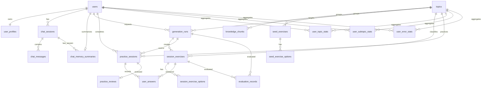

# Thiet ke DB hien tai va de xuat DB v2

Tai lieu nay tong hop lai thiet ke DB cua du an dua tren schema SQLite dang chay trong `app/persistence/schema.sql` va tinh trang `data/sqlite/app.db` duoc kiem tra ngay 2026-06-05.

Muc tieu cua tai lieu:

- Giup xem nhanh DB hien tai dang luu nhung gi.
- Phan biet du lieu nguon, du lieu chat, du lieu generate, du lieu lam bai va du lieu ca nhan hoa.
- Chi ra cac diem dang gay nhieu khi chatbot bi cung hoac ca nhan hoa sai.
- De xuat DB v2 de ho tro LLM doc lich su, ghi nho so thich va phan tich ket qua hoc tot hon.

## 1. Tong quan kien truc du lieu

DB hien tai dung SQLite lam persistence chinh cho runtime data.

Nguon noi dung hien tai co 2 lop:

- `data/processed/knowledge_chunks.json`: nguon knowledge cho retrieval/RAG.
- `data/processed/seed_exercises.json`: nguon seed exercises/fallback question bank.
- `data/sqlite/app.db`: luu user, chat, memory, generation runs, exercises da generate, answers, stats va reviews.

Luu y quan trong:

- Bang SQLite `knowledge_chunks` dang ton tai nhung hien tai trong DB dang co `0` row.
- Bang SQLite `seed_exercises` va `seed_exercise_options` dang ton tai nhung hien tai trong DB dang co `0` row.
- App hien tai van co the doc seed/chunks tu file JSON, nen DB khong phai source of truth duy nhat cho content.

## 2. ERD hien tai



## 3. Nhom bang noi dung hoc tap

### `topics`

Bang chuan hoa chu de hoc.

Cot chinh:

- `topic_code`: ma chu de on dinh, vi du `tenses`, `passive_voice`, `vocabulary`.
- `skill`: nhom ky nang, vi du `grammar`, `vocabulary`.
- `name`, `description`: hien thi va mo ta.

Vai tro:

- Lam foreign key cho knowledge, seed, generation, session va stats.
- Nen la taxonomy chuan, tranh tao topic rac tu raw text.

Van de hien tai:

- DB dang co topic rac nhu `thi`, `thi_qua_khu`.
- Cac topic nay nen duoc map ve `tenses` hoac chuyen thanh `subtopic`.

### `knowledge_chunks`

Bang nay du kien luu knowledge snippets cho RAG.

Cot chinh:

- `chunk_id`: ma chunk on dinh.
- `topic_id`, `subtopic`, `level`, `skill`: metadata retrieval.
- `content`: noi dung kien thuc.
- `examples_json`, `common_mistakes_json`, `metadata_json`: du lieu mo rong.

Tinh trang hien tai:

- Schema da co bang.
- SQLite hien tai chua import JSON vao bang nay.
- Retrieval hien tai chu yeu doc tu `data/processed/knowledge_chunks.json`.

### `seed_exercises` va `seed_exercise_options`

Bang nay du kien luu cau hoi mau/fallback.

Cot chinh:

- `exercise_code`: ma seed on dinh.
- `topic_id`, `subtopic`, `learner_level`, `difficulty`, `skill`, `exercise_type`.
- `question_text`, `correct_answer`, `explanation`, `error_tag`.
- `seed_exercise_options`: cac lua chon A/B/C/D.

Tinh trang hien tai:

- Schema da co bang.
- SQLite hien tai chua co seed rows.
- Seed bank hien tai doc tu `data/processed/seed_exercises.json`.

## 4. Nhom bang user va profile

### `users`

Bang user goc.

Cot chinh:

- `user_code`: public id, vi du `demo-user`.
- `name`, `email`.
- `created_at`.

### `user_profiles`

Bang profile hoc tap hien tai.

Cot chinh:

- `level`: `beginner`, `intermediate`, `advanced`.
- `goals_json`: danh sach muc tieu hoc.
- `preferred_difficulty`: do kho mac dinh.
- `preferred_num_questions`: so cau mac dinh.
- `onboarding_completed`: da xong onboarding hay chua.

Gioi han hien tai:

- Chua co cot cho `preferred_content_theme`, vi du `anime`.
- Chua co cot cho learning style, time budget, target exam, native language.
- Nhieu thong tin dang nam trong `chat_memory_summaries.facts_json`, nen kho query va kho thong ke.

## 5. Nhom bang chat va memory

### `chat_sessions`

Moi user co the co nhieu chat session.

Cot chinh:

- `session_code`: public id cua chat session.
- `user_id`.
- `title`.
- `status`: hien tai mac dinh `active`.
- `created_at`, `updated_at`.

### `chat_messages`

Luu tung message user/assistant.

Cot chinh:

- `message_code`: public id cua message.
- `session_id`.
- `role`: `user` hoac `assistant`.
- `content`.
- `metadata_json`: phase, generationRunId, action, interpreter...
- `created_at`.

Vai tro:

- Lam lich su chat de frontend resume.
- Lam context cho LLM doc lai doan chat gan day.
- Lam nguon trich facts cho personalization.

### `chat_memory_summaries`

Luu summary va facts da extract tu chat.

Cot chinh:

- `summary_text`: tom tat dang chuoi.
- `facts_json`: facts dang JSON, vi du `goals`, `weak_topics`, `preferred_content_theme`.
- `last_session_id`.
- `updated_at`.

Vai tro:

- Giam viec LLM phai doc toan bo chat moi lan.
- Lam memory nhanh cho intent interpreter va personalization.

Van de hien tai:

- Facts dang JSON linh hoat nhung kho query.
- `display_name`, `goals`, `weak_topics`, `content_themes` co the bi nhiem tu parser neu extractor chua chat.
- Profile va memory co the lech nhau, vi du profile name khac display name trong memory.

## 6. Nhom bang generation va bai tap

### `generation_runs`

Moi lan tao bai se co mot generation run.

Cot chinh:

- `generation_run_id`: public id cua run.
- `user_id`, `topic_id`.
- `exercise_type`, `difficulty`, `num_questions`.
- `raw_request_text`: prompt/request goc hoac request da duoc pipeline tao.
- `prompt_snapshot`: snapshot prompt gui generator.
- `retrieved_chunk_ids_json`: chunks duoc retrieve.
- `agent_trace_json`: trace pipeline, fallback reason, override metadata.
- `generator_backend`, `model_name`.
- `created_at`.

Vai tro:

- Debug generator.
- Noi session exercises voi request goc.
- Theo doi khi nao LLM thanh cong, khi nao fallback seed.

Gioi han hien tai:

- Chua co cot rieng `target_subtopic`.
- Chua co cot rieng `content_theme`.
- Chua co cot rieng `generation_status`, `fallback_reason`, `latency_ms`.
- Muon query cac thong tin nay phai parse `agent_trace_json`.

### `session_exercises`

Luu cau hoi thuc te da dua cho user.

Cot chinh:

- `session_exercise_code`, `client_exercise_id`.
- `generation_run_id`, `topic_id`.
- `exercise_type`, `difficulty`, `skill`.
- `subtopic`, `error_tag`.
- `question_text`, `correct_answer`, `explanation`.
- `source_chunk_ids_json`.
- `display_order`.

Vai tro:

- Snapshot bai tap tai thoi diem generate.
- Giu lai cau hoi de cham diem va review ve sau.

### `session_exercise_options`

Luu options cua cau hoi da generate.

Cot chinh:

- `session_exercise_id`.
- `option_label`, `option_text`.
- `is_correct`.

## 7. Nhom bang lam bai, cham diem va review

### `practice_sessions`

Moi lan user nop bai tao thanh mot practice session.

Cot chinh:

- `session_code`.
- `user_id`, `topic_id`, `generation_run_id`.
- `difficulty`, `total_questions`, `correct_count`, `accuracy`.
- `recommendation_text`.
- `started_at`, `ended_at`.

### `user_answers`

Luu cau tra loi tung cau.

Cot chinh:

- `session_id`.
- `session_exercise_id`.
- `selected_answer`.
- `is_correct`.
- `error_tag`.
- `answer_time_ms`.
- `created_at`.

Vai tro:

- Nguon tinh user stats.
- Nguon cho review LLM hoac rule-based.

### `practice_reviews`

Luu review sau khi nop bai.

Cot chinh:

- `review_code`.
- `user_id`, `session_id`.
- `evaluator`: `rule-based`, `ollama:llama3.1:8b`, ...
- `summary_text`.
- `strengths_json`, `weaknesses_json`, `next_steps_json`.
- `next_practice_prompt`.
- `raw_response`.
- `created_at`.

Vai tro:

- Bien ket qua lam bai thanh insight.
- Tao prompt luyen tiep theo.
- Lam co so ca nhan hoa sau moi session.

## 8. Nhom bang stats ca nhan hoa

### `user_topic_stats`

Thong ke theo topic.

Cot chinh:

- `attempts_count`, `correct_count`, `accuracy`.
- `weakness_score`.
- `status`.
- `last_practiced_at`.

### `user_subtopic_stats`

Thong ke chi tiet theo subtopic.

Cot chinh:

- `topic_id`, `subtopic`.
- `attempts_count`, `correct_count`, `accuracy`.
- `mastery_score`, `weakness_score`.
- `status`, `last_practiced_at`.

Vai tro:

- Quan trong nhat cho personalization sau khi lam bai.
- Giup generator chon dung diem yeu, vi du `modal_passive`, `past_simple_finished_time`.

### `user_error_stats`

Thong ke theo error tag.

Cot chinh:

- `error_tag`.
- `attempts_count`, `incorrect_count`.
- `error_rate`, `weakness_score`.
- `status`, `last_seen_at`.

Vai tro:

- Cho phep tao bai theo loi cu the, vi du `missing_be`, `wrong_tense`.
- Tot cho feedback nghiem tuc sau khi user nop bai.

## 9. Bang evaluation

### `evaluation_records`

Bang nay du kien dung de danh gia chat luong generation/retrieval.

Cot chinh:

- `evaluation_code`.
- `generation_run_id`, `session_exercise_id`.
- `evaluator`.
- `fluency`, `relevance`, `answerability`, `difficulty_appropriateness`.
- `distractor_quality`, `personalization_usefulness`.
- `comment`.
- `created_at`.

Tinh trang hien tai:

- Schema da co.
- DB hien tai chua co evaluation records.

## 10. Cac van de DB hien tai can phan tich

### 10.1. Content source chua thong nhat

SQLite co bang `knowledge_chunks` va `seed_exercises`, nhung hien tai du lieu thuc nam trong JSON.

He qua:

- Kho audit version cua seed/chunk.
- Kho query seed nao duoc dung nhieu.
- Kho link seed exercise voi session exercise.

Huong xu ly:

- Chon JSON la source of truth va khong can bang DB cho seed/chunks.
- Hoac import JSON vao DB va de DB la source of truth khi chay app.

### 10.2. Generation trace qua nhieu JSON

Nhieu thong tin quan trong dang nam trong `agent_trace_json`.

Vi du:

- `content_theme`.
- `target_subtopic`.
- LLM timeout hay network error.
- fallback sang curated seed.

He qua:

- Query cham va kho.
- Dashboard kho thong ke.
- Review chat luong generation kho lam.

Huong xu ly:

- Them cot typed vao `generation_runs`.
- Giu `agent_trace_json` chi de debug chi tiet.

### 10.3. Memory va profile co the bi lech

`user_profiles` la profile chinh, nhung `chat_memory_summaries.facts_json` cung co profile-like facts.

He qua:

- User co the duoc goi bang ten cu trong memory.
- Goals co the bi gom qua rong.
- Preference moi nhu anime khong nam trong profile typed.

Huong xu ly:

- Tao bang `user_preferences`.
- Tao rule sync mot chieu ro rang: chat facts -> pending facts -> accepted profile.
- Cho phep user xem/sua memory tren trang personalization.

### 10.4. Topic taxonomy co topic rac

DB hien tai co `thi`, `thi_qua_khu`.

He qua:

- Stats bi tach sai.
- Personalization co the uu tien sai topic.

Huong xu ly:

- Chuan hoa aliases trong parser ve `topic_code` chuan.
- Migate stats cua `thi`, `thi_qua_khu` ve `tenses`.
- Dung `subtopic` cho `past_simple_finished_time` thay vi tao topic moi.

## 11. De xuat DB v2

DB v2 nen giu cac bang hien tai nhung them typed columns va bang preference rieng.

### 11.1. Them cot cho `generation_runs`

Cot de xuat:

- `target_subtopic TEXT`.
- `content_theme TEXT`.
- `generation_status TEXT`: `success`, `fallback`, `failed`.
- `fallback_reason TEXT`.
- `source_mode TEXT`: `llm`, `seed`, `hybrid`.
- `latency_ms INTEGER`.
- `request_json TEXT`.
- `plan_json TEXT`.

Loi ich:

- Query dashboard nhanh.
- Biet khi nao LLM that su sinh bai.
- Biet user nao hay dung theme nao.

### 11.2. Them bang `user_preferences`

De xuat:

```sql
CREATE TABLE user_preferences (
    id INTEGER PRIMARY KEY AUTOINCREMENT,
    user_id INTEGER NOT NULL,
    preference_key TEXT NOT NULL,
    preference_value TEXT NOT NULL,
    confidence REAL NOT NULL DEFAULT 0.7,
    source TEXT NOT NULL DEFAULT 'chat',
    status TEXT NOT NULL DEFAULT 'active',
    created_at TEXT NOT NULL DEFAULT CURRENT_TIMESTAMP,
    updated_at TEXT NOT NULL DEFAULT CURRENT_TIMESTAMP,
    UNIQUE (user_id, preference_key, preference_value),
    FOREIGN KEY (user_id) REFERENCES users(id)
);
```

Vi du:

- `preferred_content_theme = anime`.
- `preferred_num_questions = 10`.
- `learning_goal = daily_communication`.
- `avoid_theme = horror`.

### 11.3. Them bang `user_memory_facts`

Neu muon memory query duoc tot hon, co the tach facts khoi JSON.

```sql
CREATE TABLE user_memory_facts (
    id INTEGER PRIMARY KEY AUTOINCREMENT,
    user_id INTEGER NOT NULL,
    fact_key TEXT NOT NULL,
    fact_value TEXT NOT NULL,
    confidence REAL NOT NULL DEFAULT 0.7,
    source_message_id INTEGER,
    status TEXT NOT NULL DEFAULT 'active',
    created_at TEXT NOT NULL DEFAULT CURRENT_TIMESTAMP,
    updated_at TEXT NOT NULL DEFAULT CURRENT_TIMESTAMP,
    FOREIGN KEY (user_id) REFERENCES users(id),
    FOREIGN KEY (source_message_id) REFERENCES chat_messages(id)
);
```

Luu y:

- Van co the giu `chat_memory_summaries` de LLM doc nhanh.
- `user_memory_facts` dung cho query, dashboard va user edit memory.

### 11.4. Them bang link source cua exercise

Hien tai `session_exercises` chua noi ro cau hoi tu LLM hay seed nao.

De xuat:

```sql
CREATE TABLE session_exercise_sources (
    id INTEGER PRIMARY KEY AUTOINCREMENT,
    session_exercise_id INTEGER NOT NULL,
    source_type TEXT NOT NULL,
    source_id TEXT,
    source_metadata_json TEXT NOT NULL DEFAULT '{}',
    created_at TEXT NOT NULL DEFAULT CURRENT_TIMESTAMP,
    FOREIGN KEY (session_exercise_id) REFERENCES session_exercises(id)
);
```

Vi du:

- `source_type = seed_exercise`, `source_id = seed_passive_anime_modal_001`.
- `source_type = llm`, `source_id = llama3.1:8b`.
- `source_type = knowledge_chunk`, `source_id = grammar_passive_001`.

### 11.5. Them bang taxonomy subtopic

Subtopic hien dang la text tu do.

De xuat:

```sql
CREATE TABLE subtopics (
    id INTEGER PRIMARY KEY AUTOINCREMENT,
    topic_id INTEGER NOT NULL,
    subtopic_code TEXT NOT NULL,
    name TEXT,
    description TEXT,
    created_at TEXT NOT NULL DEFAULT CURRENT_TIMESTAMP,
    UNIQUE (topic_id, subtopic_code),
    FOREIGN KEY (topic_id) REFERENCES topics(id)
);
```

Loi ich:

- Tranh subtopic bi typo.
- Lam dashboard va recommendation de hon.
- Map aliases ve subtopic chuan.

## 12. Luong du lieu ly tuong sau DB v2

```text
User chat
  -> chat_messages
  -> LLM/rule extracts facts
  -> user_memory_facts + chat_memory_summaries
  -> accepted facts sync to user_profiles/user_preferences

Practice request
  -> intent interpretation
  -> generation_runs with typed request fields
  -> retrieval from knowledge_chunks
  -> generated/seed exercises saved to session_exercises
  -> source links saved to session_exercise_sources

User submits answers
  -> practice_sessions
  -> user_answers
  -> update user_topic_stats/user_subtopic_stats/user_error_stats
  -> practice_reviews
  -> next recommendation updates profile/preferences
```

## 13. SQL query goi y de phan tich DB

Xem generation nao dang fallback:

```sql
SELECT
    generation_run_id,
    generator_backend,
    raw_request_text,
    agent_trace_json,
    created_at
FROM generation_runs
ORDER BY id DESC
LIMIT 20;
```

Xem memory cua user:

```sql
SELECT
    u.user_code,
    m.summary_text,
    m.facts_json,
    m.updated_at
FROM chat_memory_summaries m
JOIN users u ON u.id = m.user_id
ORDER BY m.updated_at DESC;
```

Xem diem yeu theo subtopic:

```sql
SELECT
    u.user_code,
    t.topic_code,
    s.subtopic,
    s.attempts_count,
    s.correct_count,
    s.accuracy,
    s.weakness_score,
    s.status
FROM user_subtopic_stats s
JOIN users u ON u.id = s.user_id
JOIN topics t ON t.id = s.topic_id
ORDER BY s.weakness_score DESC;
```

Xem topic co kha nang la topic rac:

```sql
SELECT
    t.topic_code,
    COUNT(DISTINCT gr.id) AS generation_runs,
    COUNT(DISTINCT ps.id) AS practice_sessions,
    COUNT(DISTINCT uts.id) AS stat_rows
FROM topics t
LEFT JOIN generation_runs gr ON gr.topic_id = t.id
LEFT JOIN practice_sessions ps ON ps.topic_id = t.id
LEFT JOIN user_topic_stats uts ON uts.topic_id = t.id
GROUP BY t.id, t.topic_code
ORDER BY t.id;
```

## 14. Ket luan ngan

DB hien tai da du cho demo nghiem tuc:

- Luu duoc chat history.
- Luu duoc memory summary.
- Luu duoc bai da generate.
- Luu duoc dap an, stats va review.

Nhung neu muon ca nhan hoa sau hon, DB can nang cap:

- Chuan hoa taxonomy topic/subtopic.
- Dua preference va memory facts ra bang typed.
- Luu `content_theme`, `target_subtopic`, `generation_status` truc tiep trong `generation_runs`.
- Link cau hoi voi seed/chunk/LLM source.
- Lam sach test data va tach demo user khoi test users.
