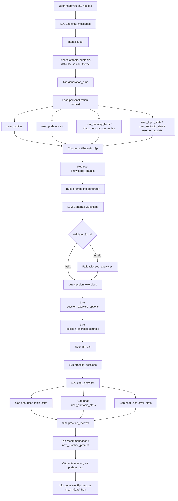

# Phân tích luồng dữ liệu và thiết kế DB cho hệ thống cá nhân hóa học tiếng Anh

## 1. Mục tiêu của tài liệu

Tài liệu này cập nhật lại phần phân tích luồng dữ liệu cho hệ thống sinh bài tập tiếng Anh cá nhân hóa.

Mục tiêu chính:

- Làm rõ hệ thống xử lý dữ liệu từ lúc user nhập yêu cầu đến lúc sinh bài tập.
- Phân biệt các nhóm dữ liệu: chat, profile, memory, knowledge, generation, practice, review và stats.
- Chỉ ra dữ liệu nào cần đọc, dữ liệu nào cần ghi ở từng bước.
- Đề xuất luồng DB v2 để hỗ trợ cá nhân hóa tốt hơn.
- Giúp phần thiết kế hệ thống trong proposal/báo cáo rõ ràng và thuyết phục hơn.

---

## 2. Tư duy tổng quan

Hệ thống không nên được hiểu đơn giản là chatbot sinh câu hỏi.

Luồng đúng nên là một vòng lặp học tập cá nhân hóa:

```text
Generate → Practice → Analyze → Personalize → Generate better next time
```

Nói cách khác, hệ thống cần:

1. Hiểu yêu cầu học tập của user.
2. Đọc profile, memory và lịch sử làm bài.
3. Sinh bài tập dựa trên knowledge base.
4. Lưu lại câu hỏi đã sinh.
5. Ghi nhận kết quả làm bài.
6. Phân tích lỗi sai.
7. Cập nhật cá nhân hóa cho lần học tiếp theo.

---

## 3. Luồng tổng quan hệ thống

```text
User chat / yêu cầu luyện tập
        ↓
Lưu chat message
        ↓
Intent Parser
        ↓
Đọc profile + preferences + memory + stats
        ↓
Tạo personalization context
        ↓
Chọn topic / subtopic / difficulty / theme
        ↓
Retrieve kiến thức từ knowledge chunks
        ↓
Generate câu hỏi bằng LLM
        ↓
Validate câu hỏi
        ↓
Nếu lỗi thì fallback sang seed exercises
        ↓
Lưu generation run + session exercises + options + sources
        ↓
User làm bài
        ↓
Chấm điểm + lưu user answers
        ↓
Cập nhật stats
        ↓
Sinh review + recommendation
        ↓
Cập nhật memory/preferences cho lần học sau
```

Đây là luồng chính nên dùng trong báo cáo.

---

## 4. Luồng 1: User chat và phân tích intent

### 4.1. Input từ user

Ví dụ user nhập:

```text
Cho mình 10 câu passive voice mức trung bình, ví dụ theo anime.
```

Hệ thống cần phân tích được:

```json
{
  "topic": "passive_voice",
  "subtopic": "modal_passive",
  "difficulty": "medium",
  "num_questions": 10,
  "content_theme": "anime",
  "exercise_type": "multiple_choice"
}
```

### 4.2. Bảng DB liên quan

| Bước | Bảng DB | Vai trò |
|---|---|---|
| Lưu tin nhắn user | `chat_messages` | Lưu request gốc |
| Lưu phiên chat | `chat_sessions` | Gom các message trong cùng phiên |
| Lưu kết quả generate | `generation_runs` | Lưu request đã được diễn giải và metadata generate |

### 4.3. Vấn đề hiện tại

Hiện tại nhiều thông tin quan trọng có thể đang nằm trong `agent_trace_json`, ví dụ:

- `target_subtopic`
- `content_theme`
- `fallback_reason`
- lỗi LLM
- trạng thái generate
- latency

Điều này khiến việc query, debug và làm dashboard khó hơn.

### 4.4. Đề xuất DB v2

Nên thêm các cột typed vào `generation_runs`:

```text
target_subtopic TEXT
content_theme TEXT
generation_status TEXT
fallback_reason TEXT
source_mode TEXT
latency_ms INTEGER
request_json TEXT
plan_json TEXT
```

Trong đó:

- `generation_status`: `success`, `fallback`, `failed`
- `source_mode`: `llm`, `seed`, `hybrid`
- `fallback_reason`: lý do fallback nếu LLM lỗi

---

## 5. Luồng 2: Đọc dữ liệu cá nhân hóa

Trước khi sinh bài, hệ thống cần đọc dữ liệu cá nhân hóa của user.

### 5.1. Các nguồn cần đọc

```text
user_profiles
user_preferences
chat_memory_summaries
user_memory_facts
user_topic_stats
user_subtopic_stats
user_error_stats
```

### 5.2. Mục tiêu

Hệ thống cần trả lời được:

```text
User đang ở level nào?
User thích học theo theme gì?
User thường luyện bao nhiêu câu?
User yếu topic nào?
User yếu subtopic nào?
User hay mắc lỗi gì?
Lần trước hệ thống đã gợi ý học gì tiếp theo?
```

### 5.3. Personalization context

Sau khi đọc dữ liệu, hệ thống nên gom thành một object rõ ràng:

```json
{
  "level": "intermediate",
  "preferred_num_questions": 10,
  "preferred_content_theme": "anime",
  "weak_topics": ["passive_voice", "tenses"],
  "weak_subtopics": ["modal_passive", "past_simple_finished_time"],
  "common_error_tags": ["missing_be", "wrong_tense"],
  "last_recommendation": "Practice modal passive with medium difficulty"
}
```

Object này sẽ được đưa vào prompt hoặc rule generator.

### 5.4. Đề xuất DB v2

Nên tách preferences và memory facts thành bảng riêng.

#### Bảng `user_preferences`

Dùng để lưu sở thích và thiết lập học tập:

```sql
CREATE TABLE user_preferences (
    id INTEGER PRIMARY KEY AUTOINCREMENT,
    user_id INTEGER NOT NULL,
    preference_key TEXT NOT NULL,
    preference_value TEXT NOT NULL,
    confidence REAL NOT NULL DEFAULT 0.7,
    source TEXT NOT NULL DEFAULT 'chat',
    status TEXT NOT NULL DEFAULT 'active',
    created_at TEXT NOT NULL DEFAULT CURRENT_TIMESTAMP,
    updated_at TEXT NOT NULL DEFAULT CURRENT_TIMESTAMP,
    UNIQUE (user_id, preference_key, preference_value),
    FOREIGN KEY (user_id) REFERENCES users(id)
);
```

Ví dụ dữ liệu:

| preference_key | preference_value |
|---|---|
| `preferred_content_theme` | `anime` |
| `preferred_num_questions` | `10` |
| `learning_goal` | `daily_communication` |
| `avoid_theme` | `horror` |

#### Bảng `user_memory_facts`

Dùng để lưu facts đã extract từ chat hoặc kết quả học:

```sql
CREATE TABLE user_memory_facts (
    id INTEGER PRIMARY KEY AUTOINCREMENT,
    user_id INTEGER NOT NULL,
    fact_key TEXT NOT NULL,
    fact_value TEXT NOT NULL,
    confidence REAL NOT NULL DEFAULT 0.7,
    source_message_id INTEGER,
    status TEXT NOT NULL DEFAULT 'active',
    created_at TEXT NOT NULL DEFAULT CURRENT_TIMESTAMP,
    updated_at TEXT NOT NULL DEFAULT CURRENT_TIMESTAMP,
    FOREIGN KEY (user_id) REFERENCES users(id),
    FOREIGN KEY (source_message_id) REFERENCES chat_messages(id)
);
```

Ví dụ dữ liệu:

| fact_key | fact_value |
|---|---|
| `weak_topic` | `passive_voice` |
| `weak_subtopic` | `modal_passive` |
| `common_error` | `missing_be` |
| `learning_goal` | `improve_grammar` |

---

## 6. Luồng 3: Retrieve kiến thức

Sau khi biết topic/subtopic cần luyện, hệ thống cần lấy kiến thức liên quan.

### 6.1. Input

```json
{
  "topic": "passive_voice",
  "subtopic": "modal_passive",
  "difficulty": "medium",
  "level": "intermediate"
}
```

### 6.2. Retrieval source

Hiện tại có 2 hướng:

```text
data/processed/knowledge_chunks.json
hoặc
SQLite table: knowledge_chunks
```

### 6.3. Vấn đề hiện tại

DB đã có bảng `knowledge_chunks`, nhưng nếu dữ liệu thực vẫn nằm trong JSON thì DB chưa phải source of truth.

Điều này gây khó khăn khi:

- Muốn biết chunk nào được dùng nhiều.
- Muốn versioning kiến thức.
- Muốn link câu hỏi với nguồn kiến thức.
- Muốn audit câu hỏi sinh ra dựa trên kiến thức nào.

### 6.4. Đề xuất

Có 2 hướng, cần chọn một:

#### Cách 1: JSON là source of truth

Phù hợp demo nhỏ.

```text
knowledge_chunks.json → retrieval → generator
```

Ưu điểm:

- Dễ sửa.
- Dễ quản lý bằng file.
- Phù hợp giai đoạn prototype.

Nhược điểm:

- Khó query.
- Khó thống kê.
- Khó tracking source.

#### Cách 2: DB là source of truth

Phù hợp nếu muốn hệ thống nghiêm túc hơn.

```text
knowledge_chunks table → retrieval → generator
```

Ưu điểm:

- Query tốt.
- Link source tốt.
- Dễ audit và dashboard.

Nhược điểm:

- Cần viết script import/sync từ JSON vào DB.

### 6.5. Khuyến nghị

Với đồ án hiện tại, nên chọn hướng trung gian:

```text
JSON dùng để build/edit dữ liệu gốc
↓
Import vào SQLite
↓
App runtime đọc từ SQLite
```

Như vậy vừa dễ phát triển, vừa trình bày được thiết kế DB rõ ràng.

---

## 7. Luồng 4: Generate câu hỏi

Đây là luồng trung tâm của hệ thống.

### 7.1. Input cho generator

```json
{
  "topic": "passive_voice",
  "subtopic": "modal_passive",
  "difficulty": "medium",
  "num_questions": 10,
  "content_theme": "anime",
  "retrieved_chunks": [
    "Passive voice with modal verbs uses: modal + be + past participle."
  ],
  "personalization_context": {
    "level": "intermediate",
    "common_error_tags": ["missing_be"]
  }
}
```

### 7.2. Ba mode generate

#### Mode 1: LLM only

```text
knowledge_chunks → prompt → LLM → generated questions
```

Ưu điểm:

- Linh hoạt.
- Tạo được câu hỏi mới.
- Cá nhân hóa theo theme tốt.

Nhược điểm:

- Có thể sinh sai.
- Có thể thiếu đáp án.
- Cần validate kỹ.

#### Mode 2: Seed only

```text
seed_exercises → filter theo topic/difficulty → questions
```

Ưu điểm:

- An toàn.
- Câu hỏi chắc chắn đúng.
- Dễ demo.

Nhược điểm:

- Ít đa dạng.
- Cá nhân hóa hạn chế.

#### Mode 3: Hybrid

```text
Retrieve knowledge chunks
  ↓
LLM generate câu hỏi
  ↓
Validate
  ↓
Nếu fail → fallback seed exercises
```

Đây là mode nên dùng cho đồ án.

### 7.3. Luồng generate đề xuất

```text
Create generation_runs
        ↓
Retrieve knowledge chunks
        ↓
Build prompt
        ↓
Call LLM
        ↓
Parse output
        ↓
Validate questions
        ↓
Nếu valid:
    save as LLM-generated exercises
Nếu invalid:
    fallback seed_exercises
        ↓
Save session_exercises
        ↓
Save session_exercise_options
        ↓
Save session_exercise_sources
```

### 7.4. Validate câu hỏi

Mỗi câu hỏi cần kiểm tra:

```text
Có question_text không?
Có đủ options A/B/C/D không?
Có đúng 1 đáp án đúng không?
correct_answer có nằm trong options không?
Có explanation không?
Topic/subtopic có đúng request không?
Difficulty có phù hợp không?
Câu hỏi có trùng lặp không?
```

### 7.5. Bảng DB liên quan

| Bảng | Vai trò |
|---|---|
| `generation_runs` | Lưu một lần generate |
| `session_exercises` | Lưu câu hỏi thực tế đã đưa cho user |
| `session_exercise_options` | Lưu các lựa chọn A/B/C/D |
| `session_exercise_sources` | Link câu hỏi với nguồn sinh ra |
| `evaluation_records` | Đánh giá chất lượng câu hỏi nếu có |

### 7.6. Đề xuất thêm bảng `session_exercise_sources`

```sql
CREATE TABLE session_exercise_sources (
    id INTEGER PRIMARY KEY AUTOINCREMENT,
    session_exercise_id INTEGER NOT NULL,
    source_type TEXT NOT NULL,
    source_id TEXT,
    source_metadata_json TEXT NOT NULL DEFAULT '{}',
    created_at TEXT NOT NULL DEFAULT CURRENT_TIMESTAMP,
    FOREIGN KEY (session_exercise_id) REFERENCES session_exercises(id)
);
```

Ví dụ dữ liệu:

| source_type | source_id |
|---|---|
| `llm` | `llama3.1:8b` |
| `seed_exercise` | `seed_passive_modal_001` |
| `knowledge_chunk` | `grammar_passive_001` |

Bảng này giúp chứng minh câu hỏi được sinh ra có căn cứ.

---

## 8. Luồng 5: User làm bài và chấm điểm

Sau khi câu hỏi đã được lưu, user bắt đầu làm bài.

### 8.1. Luồng xử lý

```text
User submits answers
        ↓
Create practice_sessions
        ↓
For each answer:
    compare selected_answer with correct_answer
    save user_answers
        ↓
Calculate correct_count
        ↓
Calculate accuracy
        ↓
Update practice_sessions
```

### 8.2. Bảng DB liên quan

| Bảng | Vai trò |
|---|---|
| `practice_sessions` | Lưu tổng quan một lần làm bài |
| `user_answers` | Lưu từng câu trả lời |
| `session_exercises` | Dùng để lấy đáp án đúng |
| `session_exercise_options` | Dùng để kiểm tra đáp án |

### 8.3. Dữ liệu cần lưu trong `user_answers`

```text
session_id
session_exercise_id
selected_answer
is_correct
error_tag
answer_time_ms
created_at
```

### 8.4. Ví dụ lỗi sai

Nếu user chọn sai câu passive voice vì thiếu `be`:

```json
{
  "topic": "passive_voice",
  "subtopic": "modal_passive",
  "error_tag": "missing_be",
  "is_correct": false
}
```

Dữ liệu này rất quan trọng vì nó là đầu vào cho personalization.

---

## 9. Luồng 6: Cập nhật stats cá nhân hóa

Sau khi chấm điểm, hệ thống cần cập nhật thống kê.

### 9.1. Các bảng stats

```text
user_topic_stats
user_subtopic_stats
user_error_stats
```

### 9.2. Luồng cập nhật

```text
For each user answer:
    update topic stats
    update subtopic stats
    update error stats if wrong
```

### 9.3. Công thức gợi ý

```text
accuracy = correct_count / attempts_count
error_rate = incorrect_count / attempts_count
weakness_score = error_rate * recency_weight
mastery_score = accuracy * practice_volume_weight
```

Không cần công thức quá phức tạp trong demo. Chỉ cần giải thích hệ thống dùng accuracy, error rate và số lần luyện để ước lượng điểm yếu.

### 9.4. Vai trò của từng bảng

| Bảng | Ý nghĩa |
|---|---|
| `user_topic_stats` | User mạnh/yếu ở topic nào |
| `user_subtopic_stats` | User yếu chi tiết ở phần nào |
| `user_error_stats` | User hay mắc loại lỗi nào |

Ví dụ:

| topic | subtopic | error_tag | Kết luận |
|---|---|---|---|
| `passive_voice` | `modal_passive` | `missing_be` | User cần luyện cấu trúc modal + be + V3 |
| `tenses` | `past_simple` | `wrong_tense` | User nhầm thì quá khứ đơn |
| `articles` | `a_an_the` | `missing_article` | User hay thiếu mạo từ |

---

## 10. Luồng 7: Review và recommendation

Sau khi có kết quả làm bài, hệ thống sinh review.

### 10.1. Input cho review

```json
{
  "total_questions": 10,
  "correct_count": 7,
  "accuracy": 0.7,
  "wrong_answers": [
    {
      "topic": "passive_voice",
      "subtopic": "modal_passive",
      "error_tag": "missing_be"
    }
  ],
  "previous_stats": {
    "weak_topics": ["passive_voice"],
    "weak_subtopics": ["modal_passive"]
  }
}
```

### 10.2. Output review

```json
{
  "summary_text": "Bạn làm đúng 7/10 câu. Điểm yếu chính là modal passive.",
  "strengths": ["Nắm khá tốt passive voice cơ bản"],
  "weaknesses": ["Hay thiếu be trong modal passive"],
  "next_steps": ["Luyện thêm 10 câu modal passive mức medium"],
  "next_practice_prompt": "Generate 10 medium MCQs about modal passive focusing on missing_be errors"
}
```

### 10.3. Bảng DB liên quan

| Bảng | Vai trò |
|---|---|
| `practice_reviews` | Lưu review sau khi làm bài |
| `chat_memory_summaries` | Lưu summary ngắn để LLM đọc nhanh |
| `user_memory_facts` | Lưu facts query được |
| `user_preferences` | Cập nhật preference nếu có |

### 10.4. Luồng recommendation

```text
practice_sessions
  ↓
user_answers
  ↓
stats
  ↓
practice_reviews
  ↓
next_practice_prompt
  ↓
lần generate tiếp theo
```

Đây chính là vòng cá nhân hóa.

---

## 11. Luồng 8: Cập nhật memory và preferences

Không phải dữ liệu nào cũng nên ghi vào memory.

### 11.1. Nên lưu vào preferences

Các thông tin có tính ổn định:

```text
User thích ví dụ anime.
User thường muốn 10 câu mỗi lần.
User muốn học giao tiếp.
User muốn tránh chủ đề horror.
```

Lưu vào `user_preferences`.

### 11.2. Nên lưu vào memory facts

Các facts rút ra từ quá trình học:

```text
User yếu passive voice.
User hay sai modal passive.
User thường thiếu be khi làm câu bị động.
User nên luyện tenses tiếp theo.
```

Lưu vào `user_memory_facts`.

### 11.3. Nên lưu vào chat summary

Tóm tắt ngắn cho LLM đọc nhanh:

```text
User is an intermediate English learner. They prefer anime-themed examples.
Recently, they practiced passive voice and often made missing_be errors in modal passive questions.
```

Lưu vào `chat_memory_summaries`.

### 11.4. Không nên lưu

Không nên lưu mọi câu chat nhỏ nhặt vào preferences/memory facts, vì sẽ gây nhiễu.

Ví dụ không nên lưu:

```text
User nói "oke".
User hỏi lại "vậy sao".
User chỉ đang thử một prompt tạm thời.
```

---

## 12. Luồng dữ liệu lý tưởng sau DB v2

```text
User chat
  ↓
chat_messages
  ↓
Intent parser extracts request fields
  ↓
generation_runs with typed fields
  ↓
Load personalization context:
      user_profiles
      user_preferences
      user_memory_facts
      user_topic_stats
      user_subtopic_stats
      user_error_stats
  ↓
Retrieve from knowledge_chunks
  ↓
Generate by LLM or fallback seed
  ↓
Validate
  ↓
Save:
      session_exercises
      session_exercise_options
      session_exercise_sources
  ↓
User submits answers
  ↓
Save:
      practice_sessions
      user_answers
  ↓
Update:
      user_topic_stats
      user_subtopic_stats
      user_error_stats
  ↓
Create:
      practice_reviews
  ↓
Update:
      user_memory_facts
      chat_memory_summaries
      user_preferences if needed
```

---

## 13. Mermaid flowchart đề xuất



---

## 14. Mapping luồng với bảng DB

| Giai đoạn | Input | Output | Bảng chính |
|---|---|---|---|
| Chat | User message | Message history | `chat_messages`, `chat_sessions` |
| Intent | Raw request | Topic, subtopic, difficulty, theme | `generation_runs` |
| Personalization | Profile, memory, stats | Personalization context | `user_profiles`, `user_preferences`, `user_memory_facts`, `user_*_stats` |
| Retrieval | Topic/subtopic | Relevant chunks | `knowledge_chunks` |
| Generation | Chunks + context | Generated questions | `generation_runs`, `session_exercises` |
| Validation | Generated questions | Valid/fallback result | `generation_runs`, `agent_trace_json` |
| Source tracking | Question source | Source links | `session_exercise_sources` |
| Practice | User answers | Score | `practice_sessions`, `user_answers` |
| Stats | Answer records | Updated mastery/weakness | `user_topic_stats`, `user_subtopic_stats`, `user_error_stats` |
| Review | Score + errors | Feedback and next step | `practice_reviews` |
| Memory update | Review + behavior | New facts/preferences | `user_memory_facts`, `user_preferences`, `chat_memory_summaries` |

---

## 15. DB v2 nên ưu tiên làm gì trước?

Nếu thời gian hạn chế, nên làm theo thứ tự sau.

### Ưu tiên 1: Chuẩn hóa topic/subtopic

Vấn đề hiện tại là topic có thể bị rác như:

```text
thi
thi_qua_khu
```

Nên map về:

```text
topic = tenses
subtopic = past_simple
```

Đề xuất thêm bảng:

```sql
CREATE TABLE subtopics (
    id INTEGER PRIMARY KEY AUTOINCREMENT,
    topic_id INTEGER NOT NULL,
    subtopic_code TEXT NOT NULL,
    name TEXT,
    description TEXT,
    created_at TEXT NOT NULL DEFAULT CURRENT_TIMESTAMP,
    UNIQUE (topic_id, subtopic_code),
    FOREIGN KEY (topic_id) REFERENCES topics(id)
);
```

### Ưu tiên 2: Thêm typed columns cho `generation_runs`

Quan trọng để debug và phân tích:

```text
target_subtopic
content_theme
generation_status
fallback_reason
source_mode
latency_ms
```

### Ưu tiên 3: Thêm source tracking

Tạo bảng:

```text
session_exercise_sources
```

Đây là bảng giúp chứng minh câu hỏi sinh ra từ đâu.

### Ưu tiên 4: Tách preferences và memory facts

Tạo:

```text
user_preferences
user_memory_facts
```

Để cá nhân hóa ổn định hơn.

### Ưu tiên 5: Đồng bộ JSON content vào DB

Có thể giữ JSON để edit, nhưng runtime nên đọc từ SQLite.

---

## 16. Luồng demo nên trình bày

Khi demo, có thể dùng scenario sau:

### Bước 1: User yêu cầu

```text
Tạo cho mình 5 câu passive voice mức trung bình, ví dụ theo anime.
```

### Bước 2: Hệ thống phân tích intent

```json
{
  "topic": "passive_voice",
  "difficulty": "medium",
  "num_questions": 5,
  "content_theme": "anime"
}
```

### Bước 3: Hệ thống đọc personalization

```text
User level: intermediate
Weak topic: passive_voice
Common error: missing_be
Preferred theme: anime
```

### Bước 4: Hệ thống retrieve knowledge

```text
Passive voice structure:
S + modal + be + V3
```

### Bước 5: Hệ thống generate câu hỏi

Sinh 5 câu MCQ, mỗi câu có:

```text
question_text
options A/B/C/D
correct_answer
explanation
error_tag
```

### Bước 6: User làm bài

User chọn đáp án, hệ thống lưu vào `user_answers`.

### Bước 7: Hệ thống review

```text
Bạn làm đúng 3/5 câu.
Bạn hay sai cấu trúc modal + be + V3.
Lần sau nên luyện thêm modal passive.
```

### Bước 8: Lần học sau

Khi user nói:

```text
Cho mình luyện tiếp.
```

Hệ thống tự ưu tiên:

```text
topic = passive_voice
subtopic = modal_passive
error_tag_focus = missing_be
difficulty = medium
```

---

## 17. Kết luận

Thiết kế DB hiện tại đã đủ để demo một hệ thống sinh bài tập có lưu lịch sử, lưu đáp án và thống kê kết quả.

Tuy nhiên, để hệ thống thật sự thể hiện tính cá nhân hóa, cần làm rõ vòng lặp:

```text
Yêu cầu học tập
→ Sinh bài theo knowledge
→ User làm bài
→ Phân tích lỗi
→ Cập nhật memory/stats
→ Sinh bài tốt hơn ở lần sau
```

Các nâng cấp quan trọng nhất cho DB v2 là:

1. Chuẩn hóa `topics` và `subtopics`.
2. Thêm typed fields cho `generation_runs`.
3. Thêm `session_exercise_sources`.
4. Tách `user_preferences` và `user_memory_facts`.
5. Đồng bộ content JSON vào SQLite nếu muốn DB là source of truth.

Nếu trình bày tốt luồng này, đề tài sẽ không còn là chatbot sinh câu hỏi đơn giản, mà trở thành một hệ thống học tập cá nhân hóa có tracking, feedback và recommendation.
